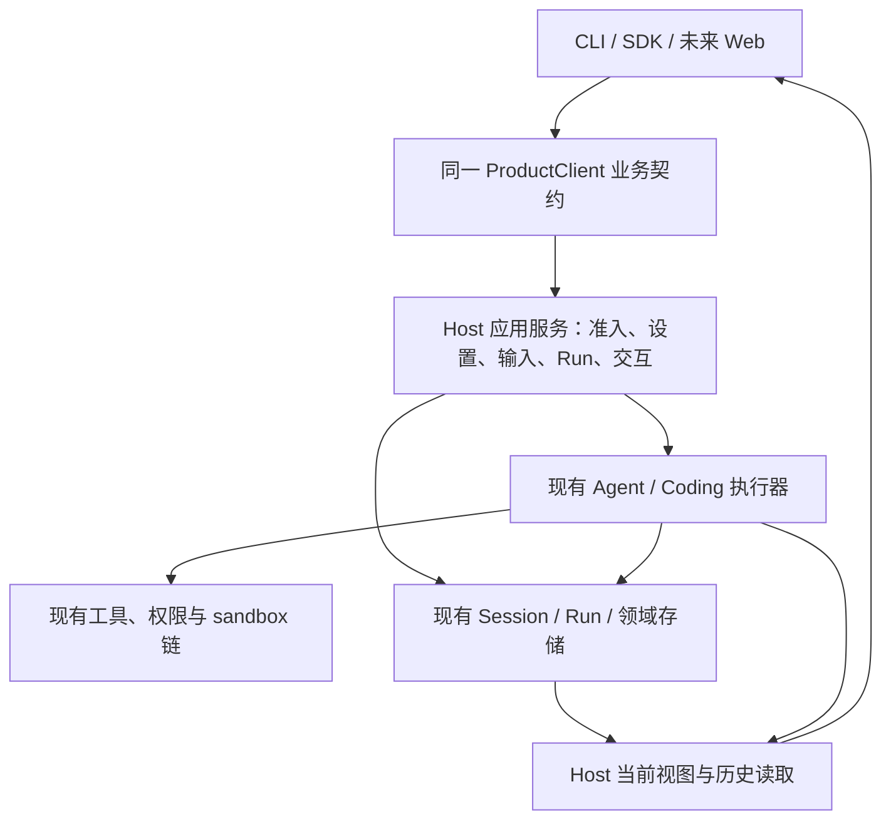

# KodaX Host 是否完备、合理：与 Codex、deepseek-harness、pi 的源码对照

结论：独立 Host 符合 KodaX 已有的后台执行、多客户端和统一业务入口要求；但当前实现尚不能认定完备。优先应修正执行准入、准备阶段和结构化输出的职责边界，再补齐 ProductClient。无需推倒执行引擎，也不能仅给现有 Runtime 再包一层方法就宣称统一完成。

## 范围与证据等级

日期：2026-09-12。三名子 Agent 分别研究三个参考仓库，主 Agent 审查 KodaX，并围绕准备阶段、权限、持久化和输出事实交叉复核。本报告使用指定本地 checkout 的源码、第一方文档及测试源码；未 fetch，未运行参考产品或本轮故障注入测试。源码可证明的调用顺序、字段丢失与接口覆盖，和仍需运行验证的后果分别描述。

| 仓库 | 本地路径 | HEAD |
| --- | --- | --- |
| KodaX | `C:/Users/ADMIN/.codex/worktrees/a72f/KodaX` | `f43f149a8cbff5f141affaf261740b89bebd8452` |
| Codex | `C:/Works/PubProj/codex` | `968835997714baaff199cfed5f89a2c65d8ca77d` |
| deepseek-harness | `C:/Works/PubProj/deepseek-harness` | `aa8262ec091698bae9a6b04773a6b5b06ad4aef2` |
| pi | `C:/Works/PubProj/pi` | `1defa151e0c1dac87d38a2d0ac09d67f817b30f9` |

下文建议不代表已实现 API 或已通过验收。现有说明书见 [CLIENT_CONTRACT.md](CLIENT_CONTRACT.md)，前一轮 R1–R8 及保护条件见 [既有评审记录](REVIEW_v0.7.97_FINAL.md)。本次扩大审查范围，并调整其中“先补接口”的优先级。

## 先区分 Host 的四类职责

Host 不只是 daemon 进程。评审必须分别判断：进程由谁持有；业务动作由谁决定；模型/工具由谁执行；客户端读取什么事实。一个独立进程可以仍然依赖 UI 完成业务编排，也可以把不完整的数据统一发给所有客户端。进程统一并不能自动证明业务统一。

KodaX 的目标边界应是下面这四类职责，而不是四个新包或新进程：

这是推荐职责图。它保留底层库独立嵌入能力，但产品 UI 不因连接失败自行启动另一执行 owner；Node ensure 管启动/更新，connect 被动连接。现有根适配器确实将 ProductClient 映射到 Runtime，独立 owner 及关闭路径也已存在，见 [adapter](../src/client-runtime-adapter.ts)、[Host owner](../src/sdk-runtime.ts:3963) 与 [连接/启动说明](CLIENT_CONTRACT.md)。

## KodaX：应保留的基础

| 已有基础 | 源码事实 | 判断 |
| --- | --- | --- |
| 单一存储写入者 | shared daemon 创建时取得 Session storage owner，close 后释放，初始化失败报告清理错误。[源码](../src/sdk-runtime.ts:3963) | 独立 Host 的必要保护，不应因追求短小删除。 |
| Session 串行准入 | `createRuntimeSessionOperationGate` 用每 Session Promise 队列串行化动作。[源码](../src/sdk-runtime.ts:6163) | 可继续复用；关键是哪些动作进入它、占用到何时，不是换一个 Actor 框架。 |
| 普通输入与 Run 身份 | product input 查重；确定性 Run 身份；普通用户输入保存后进入 Run 启动。[查重](../src/sdk-runtime.ts:10754)、[保存](../src/sdk-runtime.ts:11069) | 解决确认丢失的真实需求；不是所有身份字段都属于多余复杂度。准备路径的例外见下节。 |
| 明确停止后不擅自续跑 | drain 检查终态、显式 stop/redirect、执行 Promise 是否已结算。[源码](../src/sdk-runtime.ts:9004) | “不重复副作用、不替用户继续”有实际必要性；不能简化成所有 terminal 都 drain。 |
| 正常关闭的准入屏障 | draining 拒绝新 mutation；关闭前检查活动动作和 preflight blockers。[源码](../src/runtime-daemon/management.ts:91) | 必须保留；但方法分类需要与真实执行一致。 |
| 显示为只读投影 | SessionViewOwner 管 live 项、保存展示历史、完整 view 交付及有界正文。[源码](../src/session-view.ts:32) | 方向合理；仍需修复事实丢失和身份/读取缺口，不能用 UI 自行补事实代替。 |

这些说明当前不是“没有 Host”。它已经承担大量真实职责。另一方面，`sdk-runtime.ts` 同时包含启动连接、Session 服务、Run 服务和持久化实现，业务边界难以局部审查；这些函数分别从约 3963、6188、8810、14660 行开始。这是维护压力的证据，不以行数本身判定架构错误，也不建议先机械拆文件。[源码](../src/sdk-runtime.ts)

## KodaX：本次确认的边界问题

### H1：动态准备早于执行准入与用户输入保存

`acceptInput` 在调用 `startRun` 前执行 `prepareSkillInput`；后者调用 Host Skill expansion。动态上下文可以进入现有 `toolBash`。但 immediate 的 active Run 冲突检查在后面的 `startRun`，用户 entry 的保存更晚。因而源码允许先执行准备，再拒绝“Session 忙”；这不是新的恢复需求，而是已有顺序约束未落实。[接受路径](../src/sdk-runtime.ts:11520)、[准备](../src/sdk-runtime.ts:11116)、[受控执行](../src/sdk-runtime.ts:4889)、[忙碌检查](../src/sdk-runtime.ts:10776)、[保存](../src/sdk-runtime.ts:11069)

原规格已经要求异步准备前检查与占位、实际输入未保存前不调用工具。现状与该约束有冲突，不应通过降低规格或添加万能输入状态来掩盖。[规格](features/v0.7.97.md:239)

**建议：** 区分纯解析与真正执行。读取注册元数据、验证参数可以在执行前；动态上下文与执行 hooks 应在已准入且身份明确的现有 Run/执行上下文内进行，并受取消、权限及资源归属约束。手动草稿保留原交互，涉及动态执行时也不能伪装成纯读取。暂不新增通用 `preparing/handled` 状态或 operation ledger。

这里的输入保存顺序约束针对实际提交执行的用户输入。不能把手动草稿的“展开 → 编辑 → 取消”改成已提交 user entry 或自动发起模型 Run；其确需执行的展开采用受控执行上下文，与用户确认提交分开验收。具体复用方式留给该切片验证，不能通过一律提前提交草稿来获得表面的顺序一致。

**验证边界：** 调用顺序已确认；“准备成功后启动失败”“忙时提交动态 Skill”“确认丢失后同 ID 重提”的具体执行次数、取消与结算后果仍需故障注入。不能据静态审查宣称已经修复，也不据只读命令执行推断任意写入或沙箱逃逸。

### H2：同一准备动作的权限、取消和关闭分类不一致

底层 `invocations.prepareSkill` 被列入 `session:observe`，没有列入 mutation；协议据 mutation/reverse-bridge 分类决定 draining sensitivity。dispatcher 对这类请求允许取消等待，但 Skill preparation 调用没有传入 `requestSignal`。结合 H1 的真实工具执行，这意味着协议仍按读取处理一个可能启动受控命令的动作。[权限表](../src/runtime-daemon/server.ts:249)、[mutation 表](../src/runtime-daemon/protocol.ts:508)、[分类](../src/runtime-daemon/protocol.ts:676)、[取消分支](../src/runtime-daemon/server.ts:665)、[准备分派](../src/runtime-daemon/server.ts:1200)

**建议：** 先按动作的真实效果厘清读取与执行，纯元数据查询保持只读，执行归入既有执行准入与生命周期。只给方法改名字、只加一个 scope，或只把它列为 mutation，都不足以单独解决 H1 和执行取消归属。本项不要求重做权限系统；review 已正确列入写操作，应保持。[review 分类](../src/runtime-daemon/server.ts:255)

### H3：执行事实在进入 Host 显示投影前已经丢失

执行器已有结构化 tool result，但 `KodaXEvents.onToolResult` 只声明 id/name/content。SA dispatch 将结果转为显示文本；managed runner 同样提取文本，均没有在该事件传递原失败字段。SessionViewOwner 又按 `[Tool Error]`、`[Error]` 等文本前缀猜状态。结构化失败若正文不带这些前缀，就无法靠这条投影忠实表达；结果正文刚好带前缀也可能影响分类。[事件类型](../packages/coding/src/types.ts:543)、[SA 发出点](../packages/coding/src/agent-runtime/tool-dispatch.ts:897)、[managed 发出点](../packages/coding/src/task-engine/runner-driven.ts:2296)、[Host 推导](../src/session-view.ts:125)

**建议：** 沿已有事件传递执行器已经知道的结构化结果，Host 统一映射状态，正文只负责展示。实时与历史恢复必须对同一结果作一致解释；旧历史缺少字段时保留局部兼容入口，不让旧格式解析成为新执行的权威。不通过修改 Bash 输出格式、增加错误关键词或重写 sandbox 来修状态栏。

**验证：** 至少覆盖结构化 error + 普通正文、成功正文含类似错误字样、取消、非文本工具结果，以及实时→resume→全文读取一致性。此处确认的是信息损失，尚未运行本轮 Provider/工具故障注入。

### H4：业务仍有 UI 编排，Host 投影仍依赖旧 REPL 模块

CLI 的 Learning、Memory、注册命令/review、compact 仍通过 Runtime 旁路绑定；对应 ProductClient 只覆盖部分业务。`prepareCommand` 对 extension 等非 prompt 注册项返回 local，不能据“已提供 prepare 接口”认定命令执行已经 Host 化。[CLI](../src/kodax_cli.ts:5178)、[Runtime command](../src/runtime-invocations.ts:121)、[ProductClient adapter](../src/client-runtime-adapter.ts)

Host 的 Session view 使用 `@kodax-ai/repl` 的历史恢复与展示 helper，Runtime 也调用 REPL 中的权限与配置辅助逻辑。这证明模块职责仍混合，但 import 本身不等于越权或重复 owner。[view 依赖](../src/session-view.ts:7)、[动态准备依赖](../src/sdk-runtime.ts:4893)

**建议：** 在迁移每项已有业务时，把准入、受信任准备、调用执行器、结果归档留在 Host；编辑器、快捷键、折叠、选择和渲染留在 UI。纯 helper 按现有 agent/coding/session 层下沉或整理，不增加“为了统一”的新平台包，也不要求一次搬走全部 REPL 依赖。

注册命令须逐项保留原有忙时行为，以及无 LLM、无对话输出的结果。不能把所有命令强行当普通 prompt 排队，也不能一律 busy 拒绝。迁移的是业务归属，不是统一改变原命令的执行时机。

### H5：输出读取与当前态契约尚未闭合

此前 R2/R3/R4/R5 仍影响 Host 的产品可用性：观察失效对消费者不可见、有效预算未投影、搜索命中不能可靠通过同一 reader 打开、steer 附件未贯通执行。R6/R7/R8 还要求更正 unknown、模型选择和合批身份的说明。已有重订阅和身份修复继续保留，不作为待重做项目。[现有审查与源码依据](REVIEW_v0.7.97_FINAL.md:501)、[当前 view 类型](../packages/coding/src/client-contract.ts:384)、[观察返回](../packages/coding/src/client-contract.ts:206)

**建议：** 继续采用有界完整 view + 按需历史全文读取；补观察状态、Host 有效预算和可读命中身份。不要改成所有客户端各自拼 Runtime 事件、读取 Session 文件或恢复 Run 状态。`Run 当前选择`、`本次请求的实际用量`、`父/worker 预算`必须在已有字段含义上区分，不建立新的请求审计平台。

## 三个参考项目实际解决了什么

### Codex：最值得借鉴的是 Core 的输入裁决与结构化结果

Codex 的 ThreadManager 持有 Core thread，输入进入有序 `Op::TurnInput` 队列；Core 裁决 Started / Steered / NotSubmitted。TUI 通过 AppServerClient 使用相同 App-server 面，但部署可以是 embedded、remote 或 local daemon。**TypeScript SDK 仍每次 spawn `codex exec --experimental-json`**，所以不能声称它所有入口都共享同一个常驻 Host。[ThreadManager](/C:/Works/PubProj/codex/codex-rs/core/src/thread_manager.rs:354)、[输入队列](/C:/Works/PubProj/codex/codex-rs/core/src/session/mod.rs:924)、[准入与任务启动](/C:/Works/PubProj/codex/codex-rs/core/src/session/turn_input.rs:299)、[TUI 部署选择](/C:/Works/PubProj/codex/codex-rs/tui/src/lib.rs:927)、[SDK spawn](/C:/Works/PubProj/codex/sdk/typescript/src/exec.ts:199)

它的 `turn/start` 可以自动 steer；显式 steer 校验 expectedTurnId。这证明输入竞争应由执行 owner 裁决，但不意味着 KodaX 应删除更明确的 immediate/after_turn/steer/redirect。[turn 路由](/C:/Works/PubProj/codex/codex-rs/app-server/src/request_processors/turn_processor.rs:645)、[steer 目标检查](/C:/Works/PubProj/codex/codex-rs/app-server/src/request_processors/turn_processor.rs:1034)

工具 orchestrator 集中做策略拒绝、申请批准、选择 sandbox 和执行尝试；CommandExecution 保留 status、exitCode，MCP 保留 is_error。这比在 UI 端从正文猜状态更适合 KodaX 的共享输出目标。[orchestrator](/C:/Works/PubProj/codex/codex-rs/core/src/tools/orchestrator.rs:131)、[命令结果](/C:/Works/PubProj/codex/codex-rs/app-server-protocol/src/protocol/v2/item.rs:905)、[MCP 结果](/C:/Works/PubProj/codex/codex-rs/app-server-protocol/src/protocol/v2/mcp.rs:231)

恢复也不是无限事件重放：resume 先响应当前 thread，再同步 usage/goal 和仍存活的 pending 请求。pending callback 保存在内存；stdio server 的连接结束还会导致 server 退出。因此“重连共享 Host”和“Host 崩溃后恢复 continuation”不能混为一谈。[resume](/C:/Works/PubProj/codex/codex-rs/app-server/src/request_processors/thread_lifecycle.rs:749)、[pending map](/C:/Works/PubProj/codex/codex-rs/app-server/src/outgoing_message.rs:379)、[stdio 退出](/C:/Works/PubProj/codex/codex-rs/app-server/src/lib.rs:1150)

**取舍：** 学它的统一裁决、执行上下文、结构化事实和当前态恢复；不照搬 embedded fallback、多平台配置、远端执行器和所有历史恢复分支。没有证据要求 KodaX 增加跨重启全局恰好一次或新操作账本。

### deepseek-harness：值得借鉴执行 driver、输入归属与观察基线

Web 使用 SessionController，headless 直接 `agents.create/followup/whenIdle`，SDK 自己启动并拥有 dsh 子进程；它们共享 Agent/Session 服务，**没有共享同一完整 ProductClient 或同一常驻进程**。SDK 收集输出直到 Session idle，也不是 KodaX 指定 Run 的持久终态。[Web 控制器](/C:/Works/PubProj/deepseek-harness/packages/api/session-controller/src/index.ts:87)、[headless](/C:/Works/PubProj/deepseek-harness/packages/bundle/headless/src/index.ts:169)、[SDK 子进程](/C:/Works/PubProj/deepseek-harness/packages/sdk/client/src/client.ts:214)、[SDK idle 收集](/C:/Works/PubProj/deepseek-harness/packages/sdk/client/src/api.ts:176)

Agent 把 next-turn/next-step 输入保存在 inbox 投影，先追加输入事件再唤醒单 driver；工具调用先 append tool/call，再经 prepare 做政策/批准/取消检查，最后 dispatch。这是明确且可参考的先后关系。[Agent](/C:/Works/PubProj/deepseek-harness/packages/core/agent-loop/src/agent.ts:128)、[inbox](/C:/Works/PubProj/deepseek-harness/packages/core/agent-loop/src/inbox.ts:230)、[工具调度](/C:/Works/PubProj/deepseek-harness/packages/core/agent-loop/src/tool-calls.ts:165)

但 append 是内存提交加异步写盘。JSONL persistence 使用 buffer/timer 批量 drain，不能把上述顺序直接解释为“外部副作用前已完成耐崩溃持久化”。Web requestId 去重只比较 ID，所读实现也不能为 KodaX 的同 ID 不同附件冲突保证背书。[write-behind](/C:/Works/PubProj/deepseek-harness/packages/session/session-persistence-jsonl/src/storage.ts:274)、[requestId 查询](/C:/Works/PubProj/deepseek-harness/packages/api/session-controller/src/commands.ts:584)

它的 history.follow 先注册监听并缓冲，再读 snapshot/cursor；control stream 首帧提供 baseline，客户端重连更新 generation。可借鉴的是“新连接以当前基线收敛”，KodaX 已有完整 view，不必搬入它的多路事件与投影设施。[history follow](/C:/Works/PubProj/deepseek-harness/packages/api/session-controller/src/history.ts:145)、[control baseline](/C:/Works/PubProj/deepseek-harness/packages/api/session-controller/src/control.ts:61)、[client generation](/C:/Works/PubProj/deepseek-harness/packages/client/connection/src/client/connection.ts:165)

Shell policy/spec 在执行前明确，sandbox 包装现有执行器；这是保留执行路径、只改变可信上下文的参考。Web token/cookie 和 Host/Origin 校验支持受信任 operator 控制面，未证明逐用户 Session/文件隔离。[bash](/C:/Works/PubProj/deepseek-harness/packages/shell/tool-bash/src/index.ts:329)、[sandbox executor](/C:/Works/PubProj/deepseek-harness/packages/shell/bash-sandbox/src/index.ts:85)、[认证数据](/C:/Works/PubProj/deepseek-harness/packages/client/connection/src/browser-auth.ts:27)、[请求 fence](/C:/Works/PubProj/deepseek-harness/packages/client/connection/src/rpc-host.ts:98)

**取舍：** 学单 driver、执行前明确权限/取消、snapshot baseline；不复制 SDK 子进程 owner，不把 durable inbox 名称当磁盘提交保证，也不为了未来 Web 预建多租户平台。KodaX 的 inputId 内容冲突和 targetRunId 保护应继续保留。

### pi：成熟 AgentSession 的职责集中值得学，新 Host 框架尚不能作完成证明

传统 pi 的 Agent 用一个 activeRun 记录 Promise/AbortController；先更新状态，再顺序通知监听者。AgentSession 集中处理输入、扩展、保存、重试和压缩；Interactive、print、RPC 复用这一运行时。这是减少分散编排的好参照。[activeRun](/C:/Works/PubProj/pi/packages/agent/src/agent.ts:487)、[事件顺序](/C:/Works/PubProj/pi/packages/agent/src/agent.ts:537)、[AgentSession](/C:/Works/PubProj/pi/packages/coding-agent/src/core/agent-session.ts:1085)、[mode 入口](/C:/Works/PubProj/pi/packages/coding-agent/src/main.ts:929)

它也有明确成本边界：steer/followUp 是内存队列，持久化发生在 message_end，传统 SDK 主要重建历史上下文，stdio EOF 结束进程。这份简单性没有实现 KodaX 的全部共享 Host 保证，不能用来论证删除跨进程 owner、输入身份或共享交互。[队列](/C:/Works/PubProj/pi/packages/agent/src/agent.ts:125)、[保存顺序](/C:/Works/PubProj/pi/packages/coding-agent/src/core/agent-session.ts:649)、[历史恢复](/C:/Works/PubProj/pi/packages/coding-agent/src/core/sdk.ts:193)、[RPC EOF](/C:/Works/PubProj/pi/packages/coding-agent/src/modes/rpc/rpc-mode.ts:804)

本地版本确有新的 PiServer/Client：LiveSessionManager 合并同 Session 的 acquire，断连后保留忙碌 runtime；客户端 snapshot revision 防止旧值覆盖新值。这些通用框架已经实现。但 **AgentHarness 的 prompt、steer、followUp、resume、abort、hooks/watch 等仍明确 unavailable，对已有记录的 create.restore 也拒绝**；不能把新类型定义、mock service 测试与实际 coding Host 完整迁移混为一谈。[Session 管理](/C:/Works/PubProj/pi/packages/server/src/sessions.ts:186)、[忙时保留](/C:/Works/PubProj/pi/packages/server/src/sessions.ts:324)、[快照](/C:/Works/PubProj/pi/packages/client/src/state.ts:104)、[Harness 占位](/C:/Works/PubProj/pi/packages/agent/src/harness/agent-harness.ts:348)、[注入 service 接缝](/C:/Works/PubProj/pi/packages/server/src/types.ts:55)

尤其不能照搬其 sandbox 示例：初始化失败或 Windows 不支持时会提示 UI，然后禁用 sandbox、回退 local bash。有提示并不等于符合 KodaX 的本次执行授权边界；传统默认 bash 本身也是本机 spawn。[默认 bash](/C:/Works/PubProj/pi/packages/coding-agent/src/core/tools/bash.ts:84)、[sandbox 示例](/C:/Works/PubProj/pi/packages/coding-agent/examples/extensions/sandbox/index.ts:214)

**取舍：** 学职责集中、一个执行生命周期、复用底层执行器；不要抄一个新巨型 AgentSession 类，也不要抄未落地 Harness、内存队列的较弱保证或 sandbox 失败后仍退回无沙箱执行的策略。

## 综合取舍与实施顺序

以下是基于源码对照的建议，不是参考项目强制要求。

| 决策 | 为什么适合当前 KodaX |
| --- | --- |
| 保留独立 Host 和单写入者 | 后台工作、多客户端、共享待答交互是已有要求；三个参考项目较弱或不同的部署保证不能替代这些要求。 |
| 保留 ProductClient，修正其下的业务实现 | 薄 facade 本身没有错；真正问题是部分业务不在同一入口、执行在准入前发生、输出事实丢失。 |
| 有副作用的准备归入现有执行生命周期 | 解决 H1/H2，落实既有 spec；避免所有领域操作都扩成新的输入状态机。 |
| 新执行传结构化事实，旧历史集中兼容 | 解决 H3，减少 error 文本识别；不让每个 UI 写一套解释器。 |
| 继续完整 view + 全文读取 | 解决可观察性和跨端一致性；复用已有 generation，不增加无限回放。 |
| 按实际业务抽取现有函数 | 从调用关系上缩小 Runtime/REPL 混合职责；不按文件大小先大搬家，不加新平台框架。 |
| 保留不确定结果，禁止透明重放副作用 | 断连、终态保存失败、目标进程状态不明是不同事实；删掉 unknown 并不能消除不确定性。 |

前一轮计划应调整为：

1. **先闭合 H1/H2。** 使用已有 Session gate/Run 记录落实纯校验、接受、保存、执行顺序，明确动态上下文取消与 shutdown 归属。同时做忙时零执行、输入保存失败零工具调用、准备中停止/断连的失败注入。现有 read-only 检查、权限模式与 sandbox executor 保持约束。
2. **修 H3 和附件完整性。** SA、managed、工具结果、steer 附件都验证原始事实到 Host 再到 Client 的一致性。状态修复不能只改变 Host regex，也不能只测 schema。
3. **补当前态和全文接口。** 观察失效、Host 预算、搜索命中读取沿原 R2/R3/R4 最小方案实现；单独处理当前选择与实际请求用量，保留冻结 transcript UX。
4. **逐项迁移 H4 业务。** compact、Memory/Learning、注册命令、review/agents lean 各自使用现有领域服务。每完成一项，CLI 与纯 SDK 都经同一 ProductClient 通过行为验收，随后删除对应旁路。不把已经 Host prepare 的 Skill 再公开一套可信 metadata 往返接口。
5. **最后按边界整理代码和说明书。** 只有迁移显示出真实重复裁决时才抽取公共函数。接口覆盖表必须能追到实际执行与验收，不能用方法数量、类型编译或票据完成数替代产品完备性。

### 必须冻结的 Bash/sandbox 行为

本次架构收敛不重写 Bash 解析器、不新增 shell backend、不增加“沙箱失败就本机执行”的路径。保留 cwd/env、实时权限、明确 command/argv、timeout/AbortSignal、后台进程和清理归属。目标已开始或无法确认是否开始时不自动重跑；只有符合既有未开始证明和明确批准的路径才允许现有 fallback。批准不改变整个 Session 的权限模式。[既定边界](features/v0.7.97.md:304)、[当前动态上下文执行约束](../src/sdk-runtime.ts:4889)

已合入主线的 Windows ACL、typed multimodal tool result、interrupt identity 等修复继续作为回归基线。不能因为 Host 接口重整，把结构化工具结果重新降成字符串，或把 legacy 输入身份确认误当工具授权。[主线保护记录](REVIEW_v0.7.97_FINAL.md:597)

## 完备性验收不能只看接口与单测

| 场景 | 必须观察的结果 |
| --- | --- |
| 两客户端同时给同一 Session 提交 | Host 唯一裁决；相同 ID/意图不重复执行，不同意图冲突；迟到 stop 不影响新 Run。 |
| 忙时 immediate Skill、保存失败 | 拒绝发生在动态命令/工具执行之前，不先执行再报未接受。 |
| 手动 prompt 展开、编辑后取消 | 不自动提交 user entry、不启动模型；展开确有执行时仍受权限和取消约束，不退化为无控制读取。 |
| 无 LLM/无对话输出注册命令、忙时执行命令 | 结果及忙时行为与原命令一致，不被统一排队、统一拒绝或伪造为普通聊天输入。 |
| 动态准备/hook 期间断连或取消 | 已准入工作的状态可查询；本地 RPC 等待取消不冒充工具已停止；不透明重提。 |
| 批准请求等待时 UI 退出、另一 UI 回答 | 既有交互按 Host 身份生效，首个有效答案决定结果，观察恢复不重新执行工具。 |
| 工具失败、取消、非零退出、非文本结果 | 模型上下文、实时 UI、resume 历史三者不互相矛盾；正文和状态独立。 |
| 压缩前搜索、长工具结果与 resume | 命中身份可读全文，旧 query 不丢失，显示缓存不冒充持久终态。 |
| 两客户端改模型/窗口/权限 | 当前 view 同步；实际请求 budget/scope 明确，执行使用既定实时权限。 |
| Host 更新、进程异常、最后客户端退出 | 现有写入者保护、忙时拒绝更新、精确进程退出确认继续生效，不启动第二 owner。 |
| Windows 真实终端及 shell | 快捷键、搜索、复制、缩放与页脚无残留；已有 shell/sandbox/ACL/后台清理回归通过。 |

这些应通过真实 daemon 和纯 ProductClient 驱动，Provider 可以用离线可计数实现；关键断点检查真实执行次数和落盘状态。终端体验另外使用已有 Windows PTY 验收。参考仓库的 mock service 测试只能说明其框架行为，不能认证 KodaX 的真实执行。具体已存在的测试入口见 [前轮验收清单](REVIEW_v0.7.97_FINAL.md:605)。

## 未证实与未解问题

- 本次没有完整穷举所有 extension、后台任务、workflow、MCP 和低层 embedder 出口的效果；H1/H2 说明按方法名或 facade 清单检查会漏项。实施前需以现有具体出口做覆盖表，而非据本报告声称所有旁路已发现。
- 没有运行本轮故障注入、真实模型、Windows ACL 或 PTY。本报告不能替代执行正确性与“不退步”验收；之前的测试成绩也不能证明新增发现已关闭。
- 未证实三个参考实现提供跨重启 exactly-once、所有待答 continuation 重建、全部工具子进程可靠清理或断电无损。事件 append、file flush、进程 owner、终态保存分别是不同保证，不能相互替代。报告所引用的 DeepSeek write-behind 与 pi 新 Harness 占位尤其不能当作持久执行保证。
- 未来 Web 的传输与访问控制尚未实现；共享纯 DTO 不等于已经具备远程认证或多用户资源隔离。本次不预先建设多租户框架，未来明确访问主体和部署需求后另定访问控制边界。
- 手动 prompt 的动态展开、无对话输出的注册命令，应如何复用已有执行上下文而保留编辑体验，仍需在其具体实现切片里验证；目前确定的是禁止把有执行效果的动作伪装成读取，不先发明新的公共操作模型。

本轮交付是源码对照和设计取舍。产品代码未修改，Host 未重启，未合并、提交或发布；三个参考工作树也未修改。Codex/pi 检查时干净，deepseek-harness 仅有原有未跟踪 `.agent/`。

独立交叉复查覆盖 H1/H2/H3、Codex 段、pi 段及综合顺序。根据反方意见，更正 pi sandbox 为“有 UI 提示后回退”，并把手动草稿取消、无 LLM 命令与原忙时行为加入明确验收，避免“统一执行”反而缩减原体验。

## 实施记录（2026-09-12，以上审查保留为修改前证据）

用户批准实施后，按 H1–H5 修复当前分支。没有新增通用操作账本、输入 `preparing/handled` 状态、恢复执行器、shell backend 或 sandbox 回退策略。最终接口说明集中在 [CLIENT_CONTRACT.md](CLIENT_CONTRACT.md)，验收入口集中在 [测试指南](test-guides/FEATURE_298_v0.7.97_TEST_GUIDE.md#host-执行归属与统一业务入口回归)。

| 原问题 | 本次实现 |
| --- | --- |
| H1：Skill 在准入前执行动态工具 | Skill 发现和元数据校验不执行命令；接受并保存输入、建立 Run 后，动态展开沿该 Run 的现有工具上下文执行。忙时拒绝和保存失败不会先执行工具。同 inputId 查询复用原接收事实。 |
| H2：执行准备被当作只读 | 底层 prepareSkill 归入执行权限和 mutation，传递请求取消。Run 内准备归 Run 的 AbortController；独立准备归调用侧及 Host 关闭信号。关闭等待准备完成再释放写入所有者，Plan 沿用既有禁用规则。 |
| H3：工具结果丢失结构化事实 | SA、managed 和合成取消结果沿既有 onToolResult 传递完整 toolResult。新成功显式 is_error=false；Host 状态优先使用结构化事实，旧历史缺字段时才在兼容入口解释旧格式。 |
| H4：部分业务绕过产品接口 | compact、Memory、Learning、注册命令、review 和 agents lean 进入 ProductClient；CLI 的输入、观察、Session/Goal/Workflow 和 Auto 诊断绑定也使用同一接口。Host 解析注册表和项目内容、执行 handler、启动已有 Run/workflow；UI 跟随返回的 Run，不再次提交。单次 CLI 删除本地 Skill 准备和低层 runs.start 旁路。 |
| H5：输出、预算及全文契约不闭合 | 观察提供失效与关闭状态；新完整 view 到达后才恢复 live。当前配置预算与真实执行预算分开，worker/contextId 不混用。搜索返回可由同一 reader 读取的 itemId，steer 保留原附件。unknown、模型选择和合批身份说明按事实更正。 |

命令仍有两类结果：无模型工作的 `completed` 与已经启动的 `started`。没有输出的 extension 不伪造 user 或模型轮次；有 hook 的调用沿既有工具权限和取消路径执行，完成通知在 PostToolUse 和 Stop/SubagentStop 收尾之后发出。原 Runtime 的异常结算保护继续保留。Host 专用 commandInvocation 不接受客户端在底层 run.start 上伪造，避免低层入口绕过注册表。

这里纠正审查中的一个术语混淆：旧 UI 的 invocation `mode: manual` 是 hook 阻止执行后的显示结果，不证明已经存在“编辑命令草稿”的独立入口。`disableModelInvocation` 限制模型自动调用，不禁止用户显式执行。新增 `commands.readPrompt` 为 SDK 明确提供纯草稿读取，不执行 hook、不提交输入，不因此增设 CLI 开关或改变显式命令行为。修改后的草稿按普通输入提交，不携带可信调用元数据。

产品连接增加整体 productClient v1 要求，阻止新客户端连接后才发现旧 Host 缺业务方法。被动连接只拒绝不兼容；ensure 复用既有空闲升级与构建身份机制，不强停忙碌 Host。此能力标记不是每个 UI 自行维护的方法矩阵。

验收已按以下边界归档：真实 IPC 业务测试、准备/取消/关闭故障注入、结构化工具及预算投影、Windows 权限回归、构建声明与真实终端。最终完整套件 15,560 项通过、0 失败，另有 77 项跳过和 21 项待办；真实 PTY 32/32 通过，build/typecheck 通过。此前失败的逐项归因、Host 更新验收和独立评审结论见 [实施门禁记录](REVIEW_v0.7.97_FINAL.md)。商业模型质量、远程 Web 认证、多租户隔离和跨平台实机仍不在本轮已实现保证内。
