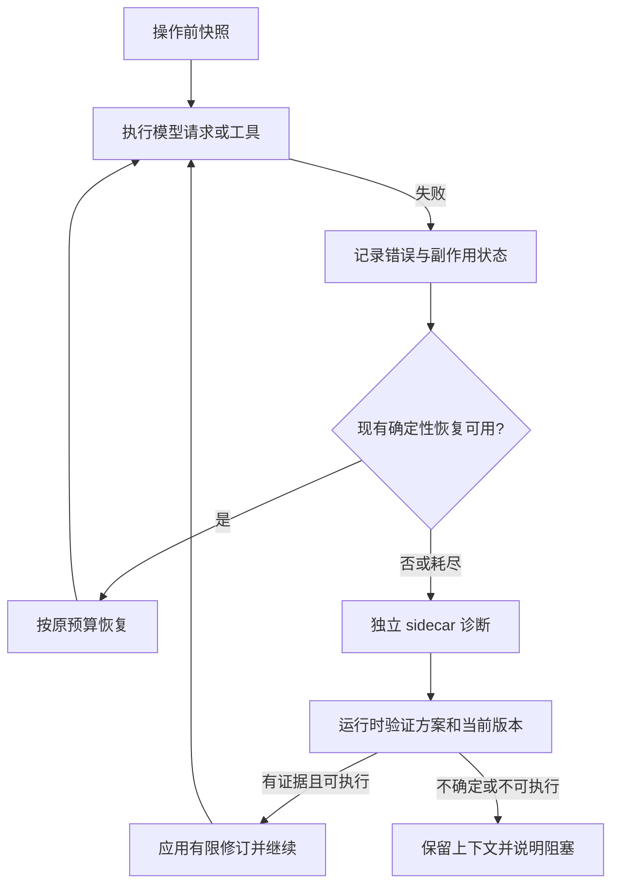

# 通用自愈 sidecar：讨论稿

状态：设计建议，尚未实现。2026-09-14。

后续讨论已转向“主 Agent 的独立文字诊断请求”，优先不另起 sidecar。
请求级可行性与实际限制见 [文字恢复实验](TEXT_RECOVERY_PROBE_2026-09-14.md)。
下文保留为原方案参考；快照、证据及恢复执行约束仍可复用，不代表当前计划实现独立 Agent。

## 目标与本次图片修复的关系

用户要求：无论什么错误，独立、干净的 sidecar 能取得出错前的上一次 context 和最新错误，
提出让主 Agent 继续的解决方案。图片入口修复已经单独落地；这里不把 sidecar 限定为图片检查器。

建议采用“统一失败入口 + 独立诊断 Agent + 受约束的恢复执行”。所有运行错误都能进入同一
诊断协议，但不能承诺所有错误都自动恢复。用户取消、权限拒绝、额度耗尽、进程崩溃、
上游不可用，也必须有明确结果，不能靠重复请求假装恢复。

正常工具错误常能由主 Agent 自己处理。因此建议默认在现有恢复耗尽、请求无法继续，或同类
工具错误反复发生时启动 sidecar；任意单次工具错误也可主动送诊。这个触发策略待讨论，
不是限制支持的错误类型。正常请求不额外调用模型。

## 1. “上一次 context”必须是失败操作实际使用的那一份

不能拿“上一次成功对话”代替，否则会丢掉用户最新指令和已经执行的工具结果。
在每次模型请求/工具执行前，记录一个不可变的操作快照引用：

| 快照内容 | 用途 |
|---|---|
| session/run/turn/operation ID、context revision | 防止诊断结果应用到新一轮输入 |
| 实际 system/developer 内容、完整消息、工具声明、模型与有效请求参数 | 复现请求；包括压缩、重排后的实际形态 |
| 原始历史引用 + 请求投影 + 两者的块索引映射 | 将上游 `messages[...].content[...]` 定位回具体附件/工具结果 |
| 附件内容摘要、格式、大小、来源、准备判定、已发送内容的快照引用 | 不让当前路径的新文件冒充出错时图片 |
| 最近工具的输入、完成/失败/结果未知状态、执行回执、幂等标识 | 决定哪些步骤绝对不能盲目重复 |
| 待处理用户输入、取消状态、已消耗重试和运行预算 | 继续时尊重最新输入及原有约束 |

运行中优先复用现有不可变消息/快照引用，不在每个 token 上深复制全文和图片。
若要求进程崩溃后也可恢复，失败操作开始前必须有已持久化的 checkpoint；只存内存无法满足。
复用现有会话/运行日志承载操作记录，避免另建一套独立的会话数据库。

原始 context 本地保留；诊断投影不含 API Key、认证头。错误体在 Provider 适配层、被转换成
通用错误之前提取：status、provider code、message、param、request ID、失败阶段和有限 cause。
未知格式保留脱敏的原始细节，不仅保留当前的 `Provider rejected the request.`。

## 2. 干净的诊断上下文

sidecar 使用独立系统指令和新消息数组。主 Agent 历史、工具输出、错误体作为待分析资料，
不直接回放成 sidecar 的 assistant/tool 协议历史，也不继承其中的指令权限。

图片、PDF、音频、巨大 Base64 不直接带入 sidecar 的模型请求。初始输入提供错误、操作说明、
最近有关消息和完整快照的索引；全文仍可通过受限只读工具分段读取，超长时明确标注未读范围。
这既保留取得完整 context 的能力，也避免坏图、坏 tool ID 或过长上下文让 sidecar 再次失败。

诊断工具建议先只提供三种能力，底层复用已有文件/媒体/运行状态实现：

1. 读取指定快照的消息、工具定义或错误片段。
2. 检查该快照引用的附件：真实字节格式、完整解码、大小、内容摘要及来源映射。
3. 查询该操作的运行状态、工具回执和已有恢复记录。

不直接给 sidecar 任意 shell、写文件、清会话或执行主任务的权限。需要修改文件、重新提取
Word 图片等工作，可由它给主 Agent 一个具体计划，再沿现有工具权限流程执行。

## 3. 返回方案与执行分开

结构化结果至少包含：

```text
failureId / contextRevision
diagnosis: 结论、已确认事实、尚未确定事项
evidenceRefs: 哪个错误字段、消息块、附件摘要支持结论
affectedRefs: 精确作用对象；没有证据时允许为空
action: retry | repair_request | continue_with_plan | blocked
preconditions: 执行前必须成立的事实
continuationAdvice: 主 Agent 下一步应该做什么
blockedReason: 无法安全继续时需要什么信息或外部变化
```

置信度分数不能授权执行。运行时校验类型、对象引用、证据、权限、context revision、取消信号
和预算，判断是否允许动作。严禁接受任意 JSON Patch 或仅凭自然语言删除消息。

| 动作 | 自动执行边界 |
|---|---|
| 原请求重试 | 现有规则确认暂时故障、预算尚余、没有需要重复的已完成工具副作用 |
| 请求修复 | 适配器支持的有限修复；目标块由证据定位；保持工具调用/结果配对；保存审计记录 |
| 带计划继续 | 请求本身可发送时追加标明来源的建议，主 Agent 按现有权限执行 |
| 暂停并解释 | 凭据、额度、权限、服务不可用、对象不确定、执行结果未知或预算耗尽 |

主请求仍含致命错误时，单纯追加“请继续/请修复”的文字无效。必须先有可验证的请求修复，
再带建议继续；做不到就返回 blocked，不能无限注入提示词。

请求修复写入可追溯的投影/修订记录，保留原消息和文件。后续发送及恢复读取已确认的修订，
以免成功一次、下一轮又携带原坏块。修订绑定附件内容摘要和上下文版本；文件变化或用户
重新读入后须重新检查。修复图片时创建新块，不让运行中既有快照被路径变化暗中替换。

## 4. 图片 400 的精确定位例子

- 上游明确给出 `param`/数组位置：先通过**本次实际请求**的块映射定位，再验证附件。
  不能拿重排前的消息下标直接删除。
- 上游只说图片解析失败：对这次请求中真正发送的图片做本地检查；完整解码失败是可行动
  证据。保留同一工具结果中的文字、正常图片、isError 和 tool_use_id。
- `1210`、`invalid_request_error` 或 HTTP 400 本身不足以证明是图片问题。至少需要相应
  图片语义的错误信息；没有附件位置时不能声称已经精确定位。
- 多图全部本地可解码、服务端又不指明位置：sidecar 可以分析格式/大小与供应商约束，
  但不能猜一张删掉，更不能清空全部图片。默认不做额外付费的逐张试探或二分请求。
- 若明确定位为可转换的格式问题，可建议兼容转换到新附件，再校验并最多重试一次。
  方向、透明度、帧数或视觉内容改变不能作为无损修复静默放行。

同一机制也支持上下文超限、工具参数不合法、协议历史不完整、文件/命令执行失败、连接异常。
具体执行仍尽量调用已有 compaction、history cleanup、工具验证和 recovery coordinator。

## 5. 调度、取消与防止恢复循环



所有回路共用失败记录与预算，不能切一个恢复器就重置次数。建议初版每次失败最多一次
诊断任务；同一操作修复后仅额外重试一次。新错误也不能不断创建新 sidecar：还需按
run/turn 统计总体预算和已经应用的修复，识别循环。

诊断任务建议最多两轮模型生成、四次只读检查、总时限 30 秒，单次最多 2k 输出 token，
并纳入原 run 的总 token/费用预算；这些是讨论用默认值，需有限实验校准，不能当性能承诺。
无合法结构化方案、超时或 sidecar 自己报错时，保留原故障，不触发“诊断 sidecar 的 sidecar”。

用户取消立即终止诊断和继续动作。诊断期间新输入保留在原队列；方案提交前重新核对
context revision，过期方案不直接应用。不自动重跑结果未知的外部写操作。

进程崩溃只能由存活的宿主/监督进程在重启后读取 checkpoint 并启动诊断；崩溃的 Agent
自身无法拉起 sidecar。OOM/磁盘满时也不能继续复制完整 context，应优先引用已持久化数据。

## 6. 复用现有代码的落点

- `packages/coding/src/agent-runtime/provider-retry-policy.ts`：已有分类、恢复决策和事件入口。
  在终止前进入统一诊断；SA/AMA 共用同一诊断协调函数，不各写一套恢复循环。
- `packages/coding/src/resilience/recovery-coordinator.ts`：已有新连接、稳定边界、非流式回退、
  thinking 修复。继续使用已有规则和预算，sidecar 不能绕过它们无限重试。
- `packages/agent` 的 `invokeLlmJudge`：复用独立上下文、结构化报告及超时基础设施。
  需要只读调查时再接受限 Runner。禁止继承现有 stall sidecar 的“诊断失败视为不卡住”
  或 verifier 的默认 accept 语义；恢复失败必须明确不执行新动作。
- `packages/coding/src/agent-runtime/middleware/stall-sidecar/`：现有循环检测可作为一个触发源，
  但通用故障诊断不能只依赖重复工具检测，否则首次致命 400 永远进不来。
- Session/Runtime 日志：承载快照、失败、方案、执行前条件和结果。Space 展示“分析中/已恢复/
  需要处理”的恢复事件，最终失败时保留原错误证据，避免先宣告成功再静默停住。

默认先使用当前已配置的模型；若错误是当前供应商不可用/凭据失效，同模型 sidecar 也可能
失败。只有用户已经配置并允许的备用模型才能接管，不自动找别家发送上下文。

## 7. 验收与建议的实施顺序

先实现快照和统一失败包；用固定错误样本验证无信息丢失及脱敏。随后接入只读诊断和严格
方案校验；最后接自动恢复，至少覆盖图片解析错误、上下文超限、连接失败三类真实用例。
每阶段保留原运行路径，sidecar 不可用不能使正常运行退化。

重点回归：单坏图夹正常图、无位置多图 400、非图片 1210、工具调用顺序、压缩后索引映射、
无效方案、sidecar 失败/超时、取消、新输入竞争、已执行/结果未知的写工具、反复换错误
绕预算、上下文过长、守护进程重启、主模型不可用且无备用模型。

讨论重点：

1. 接受“现有恢复无法继续或重复失败才自动启动”的默认策略，还是每个工具错误都诊断？
2. 初版默认仅对有确定证据的请求修复自动继续；其他情况给计划或阻塞说明，是否符合预期？
3. 是否要求首版包含跨进程崩溃恢复与独立备用模型？这会扩大持久化和配置的实现范围。

参考本次已完成的图片工作：[回归指南](../test-guides/ISSUE_335_v0.7.96_REGRESSION_GUIDE.md)。
本地 Codex 参考 `codex-rs/core/src/session/mod.rs` 的接收/恢复准备及
`codex-rs/core/src/session/turn.rs` 的 InvalidImageRequest 分支；后者仍提示移除图片后重试，
并没有这里提出的通用自愈 sidecar。不要将本草案描述成 Codex 已有实现。
